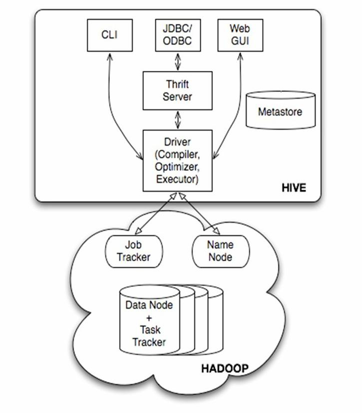
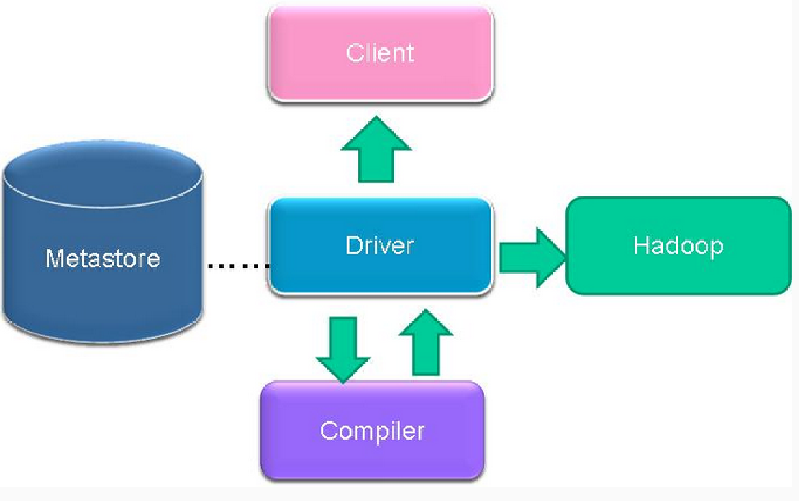

###环境

```
netstat -ntlp 
```

**windows**

```
c:/windows/system32/drivers/etc/hosts
192.168.73.128	hdp-01
192.168.73.129	hdp-02
192.168.73.130	hdp-03
192.168.73.131	hdp-04
```

**linux**

```mysql
##关闭防火墙
systemctl stop firewalld.service
**修改hosts**
vi /etc/hosts
192.168.73.128	hdp-01
192.168.73.129	hdp-02
192.168.73.130	hdp-03
192.168.73.131	hdp-04
###环境配置
export HADOOP_HOME=/usr/local/hadoop-2.8.1
export PATH=$PATH:$JAVA_HOME/bin:$HADOOP_HOME/bin:$HADOOP_HOME/sbin
```

**jdk**

```shell
/usr/local/java/jdk/jdk1.8.0_144	
##环境变量复制到其他节点
scp -r /etc/profile hdp-02:/etc/profile
scp -r /etc/profile hdp-03:/etc/profile
scp -r /etc/profile hdp-04:/etc/profile
```

**安装hadoop**

[安装](https://blog.csdn.net/lv_hulk/article/details/82949327)

```shell
##1.修改hadoop-env.sh
export JAVA_HOME=/usr/local/java/jdk/jdk1.8.0_144
##2.修改core-site.xml
<configuration>
<property>
<name>fs.defaultFS</name>
<value>hdfs://hdp-01:9000</value>
</property>
</configuration>
##3.修改hdfs-site.xml
<configuration>
<property>
<name>dfs.namenode.name.dir</name>
<value>/root/dfs/name</value>
</property>

<property>
<name>dfs.datanode.data.dir</name>
<value>/root/dfs/data</value>
</property>

</configuration>
##4.拷贝整个hadoop安装目录到其他机器
scp -r /usr/local/hadoop-2.8.1  hdp-02:/usr/local/hadoop-2.8.1
scp -r /usr/local/hadoop-2.8.1  hdp-03:/usr/local/hadoop-2.8.1
scp -r /usr/local/hadoop-2.8.1  hdp-04:/usr/local/hadoop-2.8.1
##配置secory
scp -r /usr/local/hadoop-2.8.1/etc/hadoop/hdfs-site.xml  hdp-02:/usr/local/hadoop-2.8.1/etc/hadoop/hdfs-site.xml
scp -r /usr/local/hadoop-2.8.1/etc/hadoop/hdfs-site.xml  hdp-03:/usr/local/hadoop-2.8.1/etc/hadoop/hdfs-site.xml
scp -r /usr/local/hadoop-2.8.1/etc/hadoop/hdfs-site.xml  hdp-04:/usr/local/hadoop-2.8.1/etc/hadoop/hdfs-site.xml
###5.配置变量
export HADOOP_HOME=/usr/local/hadoop-2.8.1
export PATH=$PATH:$JAVA_HOME/bin:$HADOOP_HOME/bin:$HADOOP_HOME/sbin
###6.初始化namenode的元数据存储目录
hadoop namenode -format
###7.启动 启动namenode进程（在hdp-01上）
hadoop-daemon.sh start namenode
##starting hdp-01, logging to /usr/local/hadoop-2.8.1/logs/hadoop-root-hdp-01-pinyoyougou-docker.out
#####启动完后，首先用jps查看一下namenode的进程是否存在
##8.访问
http://hdp-01:50070
##集群启动
/usr/local/hadoop-2.8.1/sbin/start-dfs.sh 
##集群关闭
/usr/local/hadoop-2.8.1/sbin/stop-dfs.sh
```

**如何配置SSH免密登录**

[免密登录设置](https://blog.csdn.net/qq_42493452/article/details/86214090)

```shell
##
/root/.ssh
##创建
ssh localhost
#
ssh-keygen -t rsa 
cat id_rsa.pub >> authorized_keys    # 加入授权
chmod 600 authorized_keys    # 修改文件权限，如果不修改文件权限，那么其它用户就能查看该授权
##复制 ,注意没有目录要先创建
scp /root/.ssh/authorized_keys root@hdp-02:~/.ssh
scp /root/.ssh/authorized_keys root@hdp-03:~/.ssh
scp /root/.ssh/authorized_keys root@hdp-04:~/.ssh
```

### HDFS命令

```shell
##上传文件到hdfs中
hadoop fs -put /本地文件  /aaa
hadoop fs -put /aa.txt /aaa
##下载文件到客户端本地磁盘
hadoop fs -get /hdfs中的路径   /本地磁盘目录
##在hdfs中创建文件夹
hadoop fs -mkdir  -p /aaa/xxx
##移动hdfs中的文件（更名）
hadoop fs -mv /hdfs的路径1  /hdfs的另一个路径2
##复制hdfs中的文件到hdfs的另一个目录
hadoop fs -cp /hdfs路径_1  /hdfs路径_2
##删除hdfs中的文件或文件夹
hadoop fs -rm -r /aaa
##查看hdfs中的文本文件内容
hadoop fs -cat /demo.txt
hadoop fs -tail -f /demo.txt
```

### 了解hive

#### 产生hive原因

>·	a) 方便对文件及数据的元数据进行管理，提供统一的元数据管理方式
>
>​	 b) 提供更加简单的方式来访问大规模的数据集，使用SQL语言进行数据分析

####原理

>​	Hive在使用过程中是使用SQL语句来进行数据分析，由SQL语句到具体的任务执行还需要经过解释器，编译器，优化器，执行器四部分才能完成。
>
>​		（1）解释器：调用语法解释器和语义分析器将SQL语句转换成对应的可执行的java代码或者业务代码
>
>​		（2）编译器：将对应的java代码转换成字节码文件或者jar包
>
>​		（3）优化器：从SQL语句到java代码的解析转化过程中需要调用优化器，进行相关策略的优化，实现最优的								 查询性能
>
>​		（4）执行器：当业务代码转换完成之后，需要上传到MapReduce的集群中执行

####数据库与数据仓库的区别

​		**注意：前三条重点掌握理解，后面的了解即可**				

​		1、数据库是对业务系统的支撑，性能要求高，相应的时间短，而数据仓库则对响应时间没有太多的要求，当然也是越快越好

​		2、数据库存储的是某一个产品线或者某个业务线的数据，数据仓库可以将多个数据源的数据经过统一的规则清洗之后进行集中统一管理

​		3、数据库中存储的数据可以修改，无法保存各个历史时刻的数据，数据仓库可以保存各个时间点的数据，形成时间拉链表，可以对各个历史时刻的数据做分析

​		4、数据库一次操作的数据量小，数据仓库操作的数据量大

​		5、数据库使用的是实体-关系（E-R）模型，数据仓库使用的是星型模型或者雪花模型

​		6、数据库是面向事务级别的操作，数据仓库是面向分析的操作

###hive安装

[hive安装](https://blog.csdn.net/qq_36508766/article/details/81318996)

```shell
## 192.168.73.128 IP
#hive 配置变量
export HIVE_HOME=/usr/local/hive
export PATH=$PATH:$HIVE_HOME/bin
##刷新环境变量
source /etc/profile
##启动
hive
hiveserver2
## 后台启动
nohup /usr/local/hive/bin  bin/hiveserver2 1>/dev/null 2>&1 &
## 连接
## 
```

### hive的架构

####Hive的架构图



####Hive的服务（角色）

##### 	1、用户访问接口

​		CLI（Command Line Interface）：用户可以使用Hive自带的命令行接口执行Hive QL、设置参数等功能

​		JDBC/ODBC：用户可以使用JDBC或者ODBC的方式在代码中操作Hive

​		Web GUI：浏览器接口，用户可以在浏览器中对Hive进行操作（2.2之后淘汰）

##### 	2、Thrift Server:

​		Thrift服务运行客户端使用Java、C++、Ruby等多种语言，通过编程的方式远程访问Hive

##### 	3、Driver

​		Hive Driver是Hive的核心，其中包含解释器、编译器、优化器等各个组件，完成从SQL语句到MapReduce任务的解析优化执行过程

##### 	4、metastore

​	Hive的元数据存储服务，一般将数据存储在关系型数据库中，为了实现Hive元数据的持久化操作，Hive的安装包中自带了Derby内存数据库，但是在实际的生产环境中一般使用mysql来存储元数据			

####Hive的访问流程图



###Hive基本SQL操作

#### Hive DDL（数据库定义语言）

>进入hive的命令行开始编写SQL语句的时候，如果没有任何相关的数据库操作，那么默认情况下，所有的表存在于default数据库，在hdfs上的展示形式是将此数据库的表保存在hive的默认路径下，如果创建了数据库，那么会在hive的默认路径下生成一个database_name.db的文件夹，此数据库的所有表会保存在database_name.db的目录下。

##### 库

```MYSQL
-- 1、数据库的基本操作
--展示所有数据库
	show databases;
--切换数据库
	use database_name;
/*创建数据库		
	CREATE (DATABASE|SCHEMA) [IF NOT EXISTS] database_name
	  [COMMENT database_comment]
	  [LOCATION hdfs_path]
	  [WITH DBPROPERTIES (property_name=property_value, ...)];
*/
	create database test;
/*
	删除数据库	
	DROP (DATABASE|SCHEMA) [IF EXISTS] database_name [RESTRICT|CASCADE];	
*/
	drop database database_name;
```

##### 表1

```mysql
/*
	创建表的操作
		基本语法：
		CREATE [TEMPORARY] [EXTERNAL] TABLE [IF NOT EXISTS] [db_name.]table_name    -- 			(Note: TEMPORARY available in Hive 0.14.0 and later)
  		[(col_name data_type [COMMENT col_comment], ... [constraint_specification])]
  		[COMMENT table_comment]
  		[PARTITIONED BY (col_name data_type [COMMENT col_comment], ...)]
  		[CLUSTERED BY (col_name, col_name, ...) [SORTED BY (col_name [ASC|DESC], ...)] 				INTO num_buckets BUCKETS]
  		[SKEWED BY (col_name, col_name, ...)                  -- (Note: Available in Hive 			0.10.0 and later)]
     	ON ((col_value, col_value, ...), (col_value, col_value, ...), ...)
     	[STORED AS DIRECTORIES]
  		[
   			[ROW FORMAT row_format] 
   			[STORED AS file_format]
     		| STORED BY 'storage.handler.class.name' [WITH SERDEPROPERTIES (...)]  -- 				(Note: Available in Hive 0.6.0 and later)
  		]
  		[LOCATION hdfs_path]
  		[TBLPROPERTIES (property_name=property_value, ...)]   -- (Note: Available in Hive 			0.6.0 and later)
  		[AS select_statement];   -- (Note: Available in Hive 0.5.0 and later; not 					supported for external tables)
 
		CREATE [TEMPORARY] [EXTERNAL] TABLE [IF NOT EXISTS] [db_name.]table_name
  			LIKE existing_table_or_view_name
  		[LOCATION hdfs_path];
 		复杂数据类型
		data_type
  		 : primitive_type
  		 | array_type
  		 | map_type
  		 | struct_type
  		 | union_type  -- (Note: Available in Hive 0.7.0 and later)
 		基本数据类型
		primitive_type
 		 : TINYINT
 		 | SMALLINT
 		 | INT
 		 | BIGINT
 		 | BOOLEAN
 		 | FLOAT
 		 | DOUBLE
  		 | DOUBLE PRECISION -- (Note: Available in Hive 2.2.0 and later)
 		 | STRING
 		 | BINARY      -- (Note: Available in Hive 0.8.0 and later)
 		 | TIMESTAMP   -- (Note: Available in Hive 0.8.0 and later)
 		 | DECIMAL     -- (Note: Available in Hive 0.11.0 and later)
 		 | DECIMAL(precision, scale)  -- (Note: Available in Hive 0.13.0 and later)
 		 | DATE        -- (Note: Available in Hive 0.12.0 and later)
 		 | VARCHAR     -- (Note: Available in Hive 0.12.0 and later)
 		 | CHAR        -- (Note: Available in Hive 0.13.0 and later)
 
		array_type
 		 : ARRAY < data_type >
 
		map_type
 		 : MAP < primitive_type, data_type >
 
		struct_type
 		 : STRUCT < col_name : data_type [COMMENT col_comment], ...>
 
		union_type
  		 : UNIONTYPE < data_type, data_type, ... >  -- (Note: Available in Hive 0.7.0 and 			later)
 		行格式规范
		row_format
 		 : DELIMITED [FIELDS TERMINATED BY char [ESCAPED BY char]] [COLLECTION ITEMS 				TERMINATED BY char]
 	       [MAP KEYS TERMINATED BY char] [LINES TERMINATED BY char]
	       [NULL DEFINED AS char]   -- (Note: Available in Hive 0.13 and later)
  			| SERDE serde_name [WITH SERDEPROPERTIES (property_name=property_value, 				property_name=property_value, ...)]
 		文件基本类型
		file_format:
 		 : SEQUENCEFILE
 		 | TEXTFILE    -- (Default, depending on hive.default.fileformat configuration)
 		 | RCFILE      -- (Note: Available in Hive 0.6.0 and later)
 		 | ORC         -- (Note: Available in Hive 0.11.0 and later)
 		 | PARQUET     -- (Note: Available in Hive 0.13.0 and later)
 		 | AVRO        -- (Note: Available in Hive 0.14.0 and later)
 		 | JSONFILE    -- (Note: Available in Hive 4.0.0 and later)
 		 | INPUTFORMAT input_format_classname OUTPUTFORMAT output_format_classname
 		表约束
		constraint_specification:
 		 : [, PRIMARY KEY (col_name, ...) DISABLE NOVALIDATE ]
 		   [, CONSTRAINT constraint_name FOREIGN KEY (col_name, ...) REFERENCES 					table_name(col_name, ...) DISABLE NOVALIDATE 
*/

--创建普通hive表（不包含行定义格式）
	create table psn
	(
	id int,
	name string,
	likes array<string>,
	address map<string,string>
	)
--创建自定义行格式的hive表
	create table psn2
	(
	id int,
	name string,
	likes array<string>,
	address map<string,string>
	)
	row format delimited
	fields terminated by ','
	collection items terminated by '-'
	map keys terminated by ':';
--创建默认分隔符的hive表（^A、^B、^C）
	create table psn3
	(
	id int,
	name string,
	likes array<string>,
	address map<string,string>
	)
	row format delimited
	fields terminated by '\001'
	collection items terminated by '\002'
	map keys terminated by '\003';
	--或者
	create table psn3
	(
	id int,
	name string,
	likes array<string>,
	address map<string,string>
	)
--创建hive的外部表(需要添加external和location的关键字)
	create external table psn4
	(
	id int,
	name string,
	likes array<string>,
	address map<string,string>
	)
	row format delimited
	fields terminated by ','
	collection items terminated by '-'
	map keys terminated by ':'
	location '/data';
/*
	在之前创建的表都属于hive的内部表（psn,psn2,psn3）,而psn4属于hive的外部表，
	内部表跟外部表的区别：
		1、hive内部表创建的时候数据存储在hive的默认存储目录中，外部表在创建的时候需要制定额外的目录
		2、hive内部表删除的时候，会将元数据和数据都删除，而外部表只会删除元数据，不会删除数据
	应用场景:
		内部表:需要先创建表，然后向表中添加数据，适合做中间表的存储
		外部表：可以先创建表，再添加数据，也可以先有数据，再创建表，本质上是将hdfs的某一个目录的数据跟				hive的表关联映射起来，因此适合原始数据的存储，不会因为误操作将数据给删除掉
*/	
/*
	hive的分区表:
		hive默认将表的数据保存在某一个hdfs的存储目录下，当需要检索符合条件的某一部分数据的时候，需要全量		遍历数据，io量比较大，效率比较低，因此可以采用分而治之的思想，将符合某些条件的数据放置在某一个目录		 ，此时检索的时候只需要搜索指定目录即可，不需要全量遍历数据。
*/
--创建单分区表
	create table psn5
	(
	id int,
	name string,
	likes array<string>,
	address map<string,string>
	)
	partitioned by(gender string)
	row format delimited
	fields terminated by ','
	collection items terminated by '-'
	map keys terminated by ':';
--创建多分区表
	create table psn6
	(
	id int,
	name string,
	likes array<string>,
	address map<string,string>
	)
	partitioned by(gender string,age int)
	row format delimited
	fields terminated by ','
	collection items terminated by '-'
	map keys terminated by ':';	
/*
	注意：
		1、当创建完分区表之后，在保存数据的时候，会在hdfs目录中看到分区列会成为一个目录，以多级目录的形式			  存在
		2、当创建多分区表之后，插入数据的时候不可以只添加一个分区列，需要将所有的分区列都添加值
		3、多分区表在添加分区列的值得时候，与顺序无关，与分区表的分区列的名称相关，按照名称就行匹配
*/	
--给分区表添加分区列的值
	alter table table_name add partition(col_name=col_value)
--删除分区列的值
	alter table table_name drop partition(col_name=col_value)
/*
	注意:
		1、添加分区列的值的时候，如果定义的是多分区表，那么必须给所有的分区列都赋值
		2、删除分区列的值的时候，无论是单分区表还是多分区表，都可以将指定的分区进行删除
*/
/*
	修复分区:
		在使用hive外部表的时候，可以先将数据上传到hdfs的某一个目录中，然后再创建外部表建立映射关系，如果在上传数据的时候，参考分区表的形式也创建了多级目录，那么此时创建完表之后，是查询不到数据的，原因是分区的元数据没有保存在mysql中，因此需要修复分区，将元数据同步更新到mysql中，此时才可以查询到元数据。具体操作如下：
*/	
--在hdfs创建目录并上传文件
	hdfs dfs -mkdir /msb
	hdfs dfs -mkdir /msb/age=10
	hdfs dfs -mkdir /msb/age=20
	hdfs dfs -put /root/data/data /msb/age=10
	hdfs dfs -put /root/data/data /msb/age=20
--创建外部表
	create external table psn7
	(
	id int,
	name string,
	likes array<string>,
	address map<string,string>
	)
	partitioned by(age int)
	row format delimited
	fields terminated by ','
	collection items terminated by '-'
	map keys terminated by ':'
	location '/msb';
--查询结果（没有数据）
	select * from psn7;
--修复分区
	msck repair table psn7;
--查询结果（有数据）
	select * from psn7;
/*
	问题：
		以上面的方式创建hive的分区表会存在问题，每次插入的数据都是人为指定分区列的值，我们更加希望能够根		  据记录中的某一个字段来判断将数据插入到哪一个分区目录下，此时利用我们上面的分区方式是无法完成操作			的，需要使用动态分区来完成相关操作，现在学的知识点无法满足，后续讲解。
*/


```

##### 创建虚表

```mysql
touch dual.txt
echo 'X' >dual.txt
load data local inpath '/hivedemo/dual.txt' overwrite into table dual;
select 'a' from dual;
```

#####表2

>外部表和内部表的区别
>
>

```mysql
show databases;
create database test_work; //新建一个测试库
use test_work;
create table course(id string);
insert into table course values("qq");
exit
#清屏
!clear
# hive 执行dfs 命令
!dfs -lsr / ; hive 执行dfs命令 
# 建库
create database db_order ;
#删除库
drop database db_order ;
## 建表,
use db_order;
create table t_order(id string,create_time string,amount float,uid string)
row format delimited
fields terminated by ',';
## 删除
drop table t_order; ##删除表
truncate table t_order; ##删除表数据
alter table t_order drop partition (partition_name='分区名') ##按照分区删除
##看表结构
desc t_order ;
##改表
drop table mvtech_text_message.t_test_tactics
## 外部表创建 external
create external table t_access(ip string,url string,access_time string)
row format delimited
fields terminated by ','
location '/access/log';
##分区表创建
create table t_access(ip string,url string,access_time string)
partitioned by(dt string)
row format delimited
fields terminated by ','
location '/access/log';
'1.2.3.4','www.baidu.com','2020-04-11','20200405'
'1.2.3.4','www.baidu.com','2020-04-11','20200422'
##导入数据
load data local inpath '/hivedemo/t_access.log' into table t_access partition(dt='20170804');
load data local inpath 'F://wordcount//spark//t_access.log' into table t_access partition(dt='20170804');
##统计
select count(*) from t_access where dt='20170804';
select count(*) from t_access;
##多个分区表
create table t_partition(id int,name string,age int)
partitioned by(department string,sex string,howold int)
row format delimited fields terminated by ',';

load data local inpath '/hivedemo/person.dat' into table t_partition partition(department='xiangsheng',sex='male',howold=20);
###CAST建表
create table t_user_2 like t_user;
create table t_access_user 
as
select ip,url from t_access;
#################数据导入导出########################
方式1：导入数据的一种方式：
手动用hdfs命令，将文件放入表目录；

方式2：在hive的交互式shell中用hive命令来导入本地数据到表目录
load data local inpath '/root/order.data.2' into table t_order;

方式3：用hive命令导入hdfs中的数据文件到表目录
load data inpath '/aaa/aa.log' into table t_access partition(dt='20170806');
#################数据导入导出########################
```

#####导入和导出

```mysql
#################数据导入导出########################
方式1：导入数据的一种方式：
手动用hdfs命令，将文件放入表目录；

方式2：在hive的交互式shell中用hive命令来导入本地数据到表目录
load data local inpath '/root/order.data.2' into table t_order;
load data local inpath '/root/5.txt'  into table iaf.t_ods_cmcc_block_sm partition(day='20200521')
方式3：用hive命令导入hdfs中的数据文件到表目录
load data inpath '/aaa/aa.log' into table t_access partition(dt='20170806');
#################数据导入导出########################
##############导出########################
5.3.2.	将hive表中的数据导出到指定路径的文件
1、将hive表中的数据导入HDFS的文件
insert overwrite directory '/root/access-data'
row format delimited fields terminated by ','
select * from t_access;

2、将hive表中的数据导入本地磁盘文件
insert overwrite local directory '/root/access-data'
row format delimited fields terminated by ','
select * from t_access limit 100000;
##############导出########################
create table dual(dummy String);

```

##### hive 表分区修该

[hive表分区修该](https://www.cnblogs.com/ggjucheng/archive/2013/01/03/2843393.html)

#### Hive DML

#####插入数据

#####1.Loading files into tables

```sql
/*
	记载数据文件到某一张表中
	语法：
		LOAD DATA [LOCAL] INPATH 'filepath' [OVERWRITE] INTO TABLE tablename [PARTITION 		(partcol1=val1, partcol2=val2 ...)]
 
		LOAD DATA [LOCAL] INPATH 'filepath' [OVERWRITE] INTO TABLE tablename [PARTITION 		(partcol1=val1, partcol2=val2 ...)] [INPUTFORMAT 'inputformat' SERDE 'serde'] 			(3.0 or later)
*/
--加载本地数据到hive表
	load data local inpath '/root/data/data' into table psn;--(/root/data/data指的是本地		linux目录)
--加载hdfs数据文件到hive表
	load data inpath '/data/data' into table psn;--(/data/data指的是hdfs的目录)
/*
	注意：
		1、load操作不会对数据做任何的转换修改操作
		2、从本地linux load数据文件是复制文件的过程
		3、从hdfs load数据文件是移动文件的过程
		4、load操作也支持向分区表中load数据，只不过需要添加分区列的值
*/
```

##### 	2、Inserting data into Hive Tables from queries

```sql
/*
	从查询语句中获取数据插入某张表
	语法：
		Standard syntax:
		INSERT OVERWRITE TABLE tablename1 [PARTITION (partcol1=val1, partcol2=val2 ...) 			[IF NOT EXISTS]] select_statement1 FROM from_statement;
		INSERT INTO TABLE tablename1 [PARTITION (partcol1=val1, partcol2=val2 ...)] 				select_statement1 FROM from_statement;
 
		Hive extension (multiple inserts):
		FROM from_statement
		INSERT OVERWRITE TABLE tablename1 [PARTITION (partcol1=val1, partcol2=val2 ...) 			[IF NOT EXISTS]] select_statement1
		[INSERT OVERWRITE TABLE tablename2 [PARTITION ... [IF NOT EXISTS]] 							select_statement2]
		[INSERT INTO TABLE tablename2 [PARTITION ...] select_statement2] ...;
			FROM from_statement
		INSERT INTO TABLE tablename1 [PARTITION (partcol1=val1, partcol2=val2 ...)] 				select_statement1
		[INSERT INTO TABLE tablename2 [PARTITION ...] select_statement2]
		[INSERT OVERWRITE TABLE tablename2 [PARTITION ... [IF NOT EXISTS]] 							select_statement2] ...;
 
		Hive extension (dynamic partition inserts):
			INSERT OVERWRITE TABLE tablename PARTITION (partcol1[=val1], partcol2[=val2] 				...) select_statement FROM from_statement;
			INSERT INTO TABLE tablename PARTITION (partcol1[=val1], partcol2[=val2] ...) 				select_statement FROM from_statement;
*/
--注意：这种方式插入数据的时候需要预先创建好结果表
--从表中查询数据插入结果表
	INSERT OVERWRITE TABLE psn9 SELECT id,name FROM psn
--从表中获取部分列插入到新表中
	from psn
	insert overwrite table psn9
	select id,name 
	insert into table psn10
	select id
```

##### 	3、Writing data into the filesystem from queries

```sql
/*
	将查询到的结果插入到文件系统中
	语法：	
	Standard syntax:
		INSERT OVERWRITE [LOCAL] DIRECTORY directory1
  		[ROW FORMAT row_format] [STORED AS file_format] (Note: Only available starting 			with Hive 0.11.0)
  		SELECT ... FROM ...
 
	Hive extension (multiple inserts):
		FROM from_statement
		INSERT OVERWRITE [LOCAL] DIRECTORY directory1 select_statement1
		[INSERT OVERWRITE [LOCAL] DIRECTORY directory2 select_statement2] ... 
		row_format
  		: DELIMITED [FIELDS TERMINATED BY char [ESCAPED BY char]] [COLLECTION ITEMS 			TERMINATED BY char]
        [MAP KEYS TERMINATED BY char] [LINES TERMINATED BY char]
        [NULL DEFINED AS char] (Note: Only available starting with Hive 0.13)
*/
--注意：路径千万不要填写根目录，会把所有的数据文件都覆盖
--将查询到的结果导入到hdfs文件系统中
	insert overwrite directory '/result' select * from psn;
--将查询的结果导入到本地文件系统中
	insert overwrite local directory '/result' select * from psn;
```

##### 	4、Inserting values into tables from SQL

```sql
/*
	使用传统关系型数据库的方式插入数据，效率较低
	语法：
	Standard Syntax:
		INSERT INTO TABLE tablename [PARTITION (partcol1[=val1], partcol2[=val2] ...)] 			VALUES values_row [, values_row ...]
  
	Where values_row is:
		( value [, value ...] )
		where a value is either null or any valid SQL literal
*/
--插入数据
	insert into psn values(1,'zhangsan')
```

#####数据更新和删除

>删除0.14 之后
>
>更新

​		在官网中我们明确看到hive中是支持Update和Delete操作的，但是实际上，是需要事务的支持的，Hive对于事务的支持有很多的限制，如下图所示：

因此，在使用hive的过程中，我们一般不会产生删除和更新的操作，如果你需要测试的话，参考下面如下配置：

```java
//在hive的hive-site.xml中添加如下配置：
	<property>
		<name>hive.support.concurrency</name>
		<value>true</value>
	</property>
	<property>
		<name>hive.enforce.bucketing</name>
		<value>true</value>
	</property>
	<property>
		<name>hive.exec.dynamic.partition.mode</name>
		<value>nonstrict</value>
	</property>
	<property>
		<name>hive.txn.manager</name>
		<value>org.apache.hadoop.hive.ql.lockmgr.DbTxnManager</value>
	</property>
	<property>
		<name>hive.compactor.initiator.on</name>
		<value>true</value>
	</property>
	<property>
		<name>hive.compactor.worker.threads</name>
		<value>1</value>
	</property>
//操作语句
	create table test_trancaction (user_id Int,name String) clustered by (user_id) into 3 			buckets stored as orc TBLPROPERTIES ('transactional'='true');
	create table test_insert_test(id int,name string) row format delimited fields 				  TERMINATED BY ',';
	insert into test_trancaction select * from test_insert_test;
	update test_trancaction set name='jerrick_up' where id=1;
//数据文件
	1,jerrick
	2,tom
	3,jerry
	4,lily
	5,hanmei
	6,limlei
	7,lucky
```

### Hive Serde


### Hive Sever2

### Hive函数

[hive函数](Hive函数.md)

>1.内置函数
>
>2.自定义函数(难点)

```shell
##类型转换函数
select cast("5" as int) from dual;
select cast("2017-08-03" as date) ;
select cast(current_timestamp as date);
##时间函数
select current_timestamp; 
select current_date;
```


###案例

```shell
create table t_access_times(username string,month string,counts int)
row format delimited fields terminated by ',';
load data local inpath '/hivedemo/accumulate.dat' into table t_access_times;
A,2015-01,5
A,2015-01,15
B,2015-01,5
A,2015-01,8
B,2015-01,25
A,2015-01,5
C,2015-01,10

1、第一步，先求个用户的月总金额
select username,month,sum(salary) as salary from t_access_times group by username,month

+-----------+----------+---------+--+
| username  |  month   | salary  |
+-----------+----------+---------+--+
| A         | 2015-01  | 33      |
| A         | 2015-02  | 10      |
| B         | 2015-01  | 30      |
| B         | 2015-02  | 15      |
+-----------+----------+---------+--+

2、第二步，将月总金额表自己连接 自己连接
select A.*,B.* FROM
(select username,month,sum(salary) as salary from t_access_times group by username,month) A 
inner join 
(select username,month,sum(salary) as salary from t_access_times group by username,month) B
on
A.username=B.username
where B.month <= A.month
+-------------+----------+-----------+-------------+----------+-----------+--+
| a.username  | a.month  | a.salary  | b.username  | b.month  | b.salary  |
+-------------+----------+-----------+-------------+----------+-----------+--+
| A           | 2015-01  | 33        | A           | 2015-01  | 33        |
| A           | 2015-01  | 33        | A           | 2015-02  | 10        |
| A           | 2015-02  | 10        | A           | 2015-01  | 33        |
| A           | 2015-02  | 10        | A           | 2015-02  | 10        |
| B           | 2015-01  | 30        | B           | 2015-01  | 30        |
| B           | 2015-01  | 30        | B           | 2015-02  | 15        |
| B           | 2015-02  | 15        | B           | 2015-01  | 30        |
| B           | 2015-02  | 15        | B           | 2015-02  | 15        |
+-------------+----------+-----------+-------------+----------+-----------+--+


第3步：
select auname,amonth,acnts,sum(bcnts)
from t_tmp2
group by auname,amonth,acnts;
得到最终结果

当然，也可以把整个逻辑过程写成一个SQL语句：

select A.username,A.month,max(A.salary) as salary,sum(B.salary) as accumulate
from 
(select username,month,sum(salary) as salary from t_access_times group by username,month) A 
inner join 
(select username,month,sum(salary) as salary from t_access_times group by username,month) B
on
A.username=B.username
where B.month <= A.month
group by A.username,A.month
order by A.username,A.month;

```

```mysql
-- 外部表
CREATE EXTERNAL TABLE if NOT EXISTS mvtech_text_message.t_message_tactics (
c_usernum string COMMENT '主叫号码',
c_relatenum  string COMMENT '被叫号码',
text_message  string COMMENT '短信内容',
illage_type  string COMMENT '违规类型')
partitioned by(day string,hour string)
row format delimited fields terminated by ','
location '/mx_projects/mvtech/mvtech_text_message';
```

#### 实现方式

>

```
https://www.cnblogs.com/ggjucheng/archive/2013/01/03/2843393.html
```

