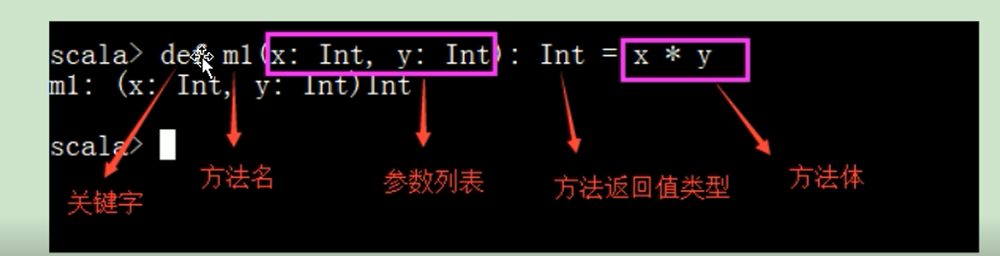

### idea如何运行scal程序

```
1.idea中安装scla插件
```

### 添加依赖插件

>idea中可以不用安装scala的sdk

```
<dependencies>
        <!-- 导入scala的依赖 -->
        <dependency>
            <groupId>org.scala-lang</groupId>
            <artifactId>scala-library</artifactId>
            <version>${scala.version}</version>
        </dependency>
    </dependencies>


    <build>
        <pluginManagement>
            <plugins>
                <!-- 编译scala的插件 -->
                <plugin>
                    <groupId>net.alchim31.maven</groupId>
                    <artifactId>scala-maven-plugin</artifactId>
                    <version>3.2.2</version>
                </plugin>
                <!-- 编译java的插件 -->
                <plugin>
                    <groupId>org.apache.maven.plugins</groupId>
                    <artifactId>maven-compiler-plugin</artifactId>
                    <version>3.5.1</version>
                </plugin>
            </plugins>
        </pluginManagement>
        <plugins>
            <plugin>
                <groupId>net.alchim31.maven</groupId>
                <artifactId>scala-maven-plugin</artifactId>
                <executions>
                    <execution>
                        <id>scala-compile-first</id>
                        <phase>process-resources</phase>
                        <goals>
                            <goal>add-source</goal>
                            <goal>compile</goal>
                        </goals>
                    </execution>
                    <execution>
                        <id>scala-test-compile</id>
                        <phase>process-test-resources</phase>
                        <goals>
                            <goal>testCompile</goal>
                        </goals>
                    </execution>
                </executions>
            </plugin>

            <plugin>
                <groupId>org.apache.maven.plugins</groupId>
                <artifactId>maven-compiler-plugin</artifactId>
                <executions>
                    <execution>
                        <phase>compile</phase>
                        <goals>
                            <goal>compile</goal>
                        </goals>
                    </execution>
                </executions>
            </plugin>


            <!-- 打jar插件 -->
            <plugin>
                <groupId>org.apache.maven.plugins</groupId>
                <artifactId>maven-shade-plugin</artifactId>
                <version>2.4.3</version>
                <executions>
                    <execution>
                        <phase>package</phase>
                        <goals>
                            <goal>shade</goal>
                        </goals>
                        <configuration>
                            <filters>
                                <filter>
                                    <artifact>*:*</artifact>
                                    <excludes>
                                        <exclude>META-INF/*.SF</exclude>
                                        <exclude>META-INF/*.DSA</exclude>
                                        <exclude>META-INF/*.RSA</exclude>
                                    </excludes>
                                </filter>
                            </filters>
                        </configuration>
                    </execution>
                </executions>
            </plugin>
        </plugins>
    </build>
```

### 关键字

```
main  主函数
var  
val  常量
String 
```

#### 数据类型

```
Byte
Char
Short
Int AnyVar Any
Long 
Float
Double(无包装类型)
Boolean
Unit (类型java void)
```


### 语法

#### class和obejct

```
主方法只能写在 object定义的文件中
object和class啥区别：
回顾一个问题：java中有一个知识点 静态
分号可有可无
object 单例
scala是包级别区分，类名可以和文件名不一致
```

#### 打印

```scala
println("hello");
println("hello "+args(0)+args(1))
```

#### var 和val

```
var 可以修改
val 常量
```

#### 占位符

```
println(f"姓名：$name%s  年龄：$age")      // 该行输出有换行
printf("%s 学费 %4.2f, 网址是%s  补充%s", name, 1234.146516, "xx",2)   // 该行输出没有换行
val stu = new Student("taotao", 18)
println(s"${name}")

println(s"${stu.name}")
```

#### 定义对象

```
class Student(var name: String, var age: Int)
```

#### if else

```scala
val r = if(i < 8) i // else 没有写， 编译器会自动推测出你什么都没有返回就是Unit

val r1 = if(i<8) i else 1

println(r1)

// 最后一行代码作为返回值
 val i: Int = 12
        val s = if(i > 10) {
            i
            i * i
        } else {
            0
            100
        }
// i=12 大于8 发挥()
 val r = if(i < 8) i // else 没有写， 编译器会自动推测出你什么都没有返回就是Unit

```

#### for

[for循环使用](https://blog.csdn.net/yang735136055/article/details/84108960)

[for](https://blog.csdn.net/qq_33366229/article/details/91445469)

```scala
//第一种
for(i <- 1 to 3){

  print(i + " ")

}
//第二种
for(i <- 1 until 3) {
  print(i + " ")
}
// i!=2
for(i <- 1 to 3 if i != 2) {
  print(i + " ")
}


//for 循环中的 yield可以当做一个看不见的临时值存储区域，每次循环结果保存在该区域中，循环结束后将返回一个集合。返回的集合和传入的集合一样（也就是你传入Array  给你返回Array，其他类似）

val array = Array[Int](1, 2, 3, 4, 5)
    val arrayAdd = for (item <- array) yield item + 100
    print(arrayAdd.mkString(","))
// 输出101,102,103,104,105

  val arrayAdd2 = changeArray(array)
    print(arrayAdd2.mkString(","))
  }

  def changeArray(array: Array[Int]) = {
    for (i <- 0 until array.length) {
      array(i) = array(i) + 100
    }
    array
  }
```

#### 运算符(重载方法)

[运算符](https://www.yiibai.com/scala/scala_operators.html)

```

```

#### 定义方法




####构造器

```scala
//==1.类型的构造器

//类里，裸露的代码是默认构造中的。有默认构造
//个性化构造！！
//类名构造器中的参数就是类的成员属性，且默认是val类型，且默认是private
//只有在类名构造其中的参数可以设置成var，其他方法函数中的参数都是val类型的，且不允许设置成var类型
object GouZao {
  def main(args: Array[String]): Unit = {
    val oxxx1:oxxx = new oxxx("aaa")
    println(oxxx1.sex)
    println(oxxx1.name)
  }

class oxxx(val sex:String){

var name="class name"

def this(xname:Int){
  this("abc")
}

var a:Int=3
//伴生关系
    
}
```

