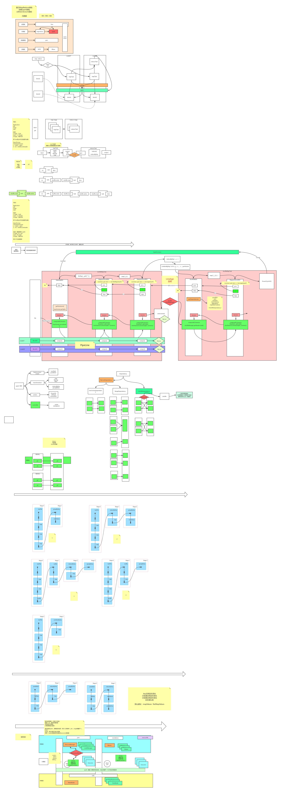

###了解Spark

[官网](http://spark.apache.org)

[下载安装包](https://blog.csdn.net/Fortuna_i/article/details/101681939?depth_1-utm_source=distribute.pc_relevant.none-task&utm_source=distribute.pc_relevant.none-task)

**了解**

>Spark是一种快速、通用、可扩展的大数据分析引擎，2009年诞生于加州大学伯克利分校AMPLab，2010年开源，2013年6月成为Apache孵化项目，2014年2月成为Apache顶级项目。目前，Spark生态系统已经发展成为一个包含多个子项目的集合，其中包含SparkSQL、Spark Streaming、GraphX、MLlib等子项目，Spark是基于内存计算的大数据并行计算框架。Spark基于内存计算，提高了在大数据环境下数据处理的实时性，同时保证了高容错性和高可伸缩性，允许用户将Spark部署在大量廉价硬件之上，形成集群。

**为什么要学习**

>中间结果输出：基于MapReduce的计算引擎通常会将中间结果输出到磁盘上，进行存储和容错。出于任务管道承接的，考虑，当一些查询翻译到MapReduce任务时，往往会产生多个Stage，而这些串联的Stage又依赖于底层文件系统（如HDFS）来存储每一个Stage的输出结果

###环境搭建

#### 集群搭建

```shell
192.168.73.132	spark-01
192.168.73.133	spark-02  00:50:56:3F:AC:C7
192.168.73.134	spark-03
--- ip 进行了修改在 128 129上
scp -r /root/sparkApp  192.168.73.128:/root/sparkApp 

```

####安装配置

[spark安装](https://blog.csdn.net/kangaroojie/article/details/80831993)

```shell
tar -zxvf spark-3.0.0-preview2-bin-hadoop2.7.tgz -C /usr/local
cd /usr/local/spark
##修改spark-env.sh.template
cd conf/
mv spark-env.sh.template spark-env.sh
vi spark-env.sh
export JAVA_HOME=/usr/local/java/jdk/jdk1.8.0_144
export SPARK_MASTER_IP=spark-01
export SPARK_MASTER_PORT=7077
##
export JAVA_HOME=/usr/local/java/jdk/jdk1.8.0_144
export SPARK_MASTER_HOST=192.168.73.132
export SPARK_MASTER_PORT=7077

##重命名并修改slaves.template文件
mv slaves.template slaves
vi slaves
##在该文件中添加子节点所在的位置（Worker节点）
spark-02
spark-03
##配置环境变量
vi /etc/profile
export SPARK_HOME=/usr/local/spark
export PATH=${PATH}:${SPARK_HOME}/bin
##将配置好的Spark拷贝到其他节点上
scp -r /usr/local/spark hdp-02:/usr/local/spark
scp -r /usr/local/spark spark-03:/usr/local/spark
scp -r /usr/local/spark/conf/spark-env.sh  spark-02/usr/local/spark/conf/spark-env.sh
##Spark集群配置完毕
/usr/local/spark/sbin/start-all.sh
/usr/local/spark/sbin/stop-all.sh
#localhost:8080
#192.168.73.132:8080
##提交第一个程序
/usr/local/spark/bin/spark-submit --master spark://spark-01:7077 --class org.apache.spark.examples.SparkPi /usr/local/spark/examples/jars/spark-examples_2.12-3.0.0-preview2.jar 100
#### 计算π值
/usr/local/spark/bin/spark-submit --master spark://spark-01:7077 --class org.apache.spark.examples.SparkPi --executor-memory 4096mb --total-executor-cores 12 /usr/local/spark/examples/jars/spark-examples_2.12-3.0.0-preview2.jar 100
####
##spark-shell
/usr/local/spark/bin/spark-shell --master spark://spark-01:7077
##
sc.textFile("hdfs://192.168.73.128:9000/aa.log").flatMap(_.split(" "))
.map((_,1)).reduceByKey(_+_).saveAsTextFile("hdfs://192.168.73.128:9000/out/bb.log")
##
sc.textFile("hdfs://node1.edu360.cn:9000/words.txt").flatMap(_.split(" "))
.map((_,1)).reduceByKey(_+_).saveAsTextFile("hdfs://node1.edu360.cn:9000/out")
##
##编辑
hadoop fs -cat /aa.log
hadoop fs -rm -r /aa.log
```

### 项目启动

```shell
/usr/local/spark/bin/spark-submit --master spark://spark-01:7077 --class com.mvtech.unfraud.Starter /prj/unfraud.jar 100

/usr/local/spark/bin/spark-submit --master spark://spark-01:7077 --class com.mvtech.unfraud.Starter /prj/unfraud.jar 100

/usr/local/spark/bin/spark-submit --master spark://spark-01:7077 --class org.apache.spark.examples.SparkPi --executor-memory 4096mb --total-executor-cores 12 /root/sparkApp/spark-examples_2.12-3.0.0-preview2.jar 100
### 128
/usr/local/spark/bin/spark-submit --master spark://hdp-01:7077 --class org.apache.spark.examples.SparkPi --executor-memory 4096mb --total-executor-cores 12 /usr/local/spark/examples/jars/spark-examples_2.12-3.0.0-preview2.jar 100

/usr/local/spark/bin/spark-submit --master yarn --executor-cores 2 --num-executors 6 --driver-memory 4G --executor-memory 8G --conf spark.files.ignoreCorruptFiles=true --class com.mvtech.mess.Starter /usr/sparkApp/mvtech-push-local.jar 100

--master yarn --executor-cores 2 --num-executors 6 --driver-memory 4G --executor-memory 8G --conf spark.files.ignoreCorruptFiles=true

##
vi /home/mx_projects/mvtech_admin/iaf/pro_files/mvtech_mess/mess.properties


export HADOOP_CONF_DIR=/usr/local/hadoop-2.8.1/etc/hadoop/

```

### 大数据组件了解

如图




###hel